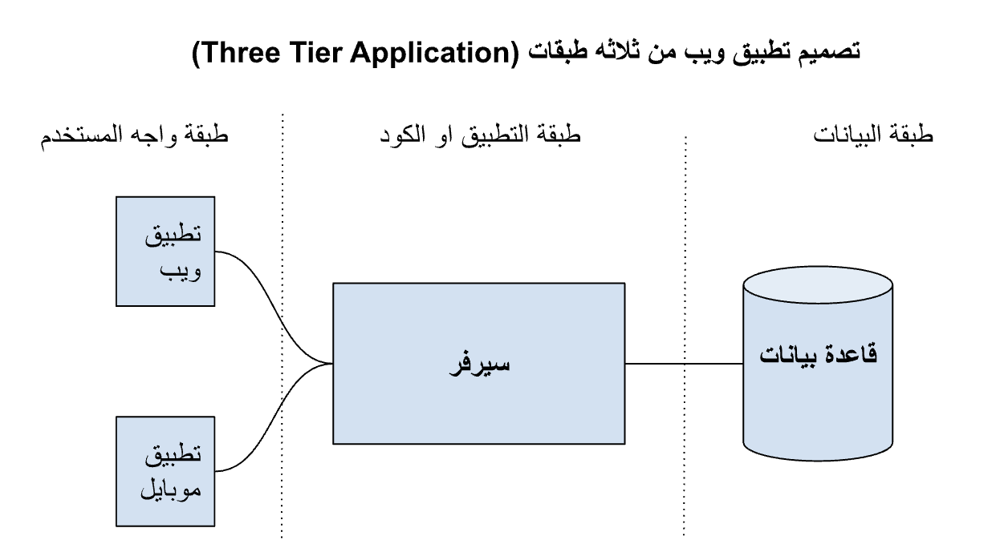

# مقدمة

لو انت شغال في صناعة البرمجيات، او حتى لو بتفكر تدخل فيها، اكيد سمعت عن مصطلحات زي Fault-Tolerance, ACID, Load-Balancer, Availability, Sharding,  Scalability إلخ.

في السنوات الاخيرة، حصل تطور رهيب في صناعه السوفتوير و خصوصا قواعد البيانات  و الانظمه الموزعه و طرق بناء تطبيقات الويب.التطور دا حصل لعده اسباب منها:
  ـ شركات الانترنت زي جوجل و فيسبوك و امازون و غيرهم بدأوا يستخدموا تقنيات جديده لبناء تطبيقاتهم لمعالجه و تخزين بيانات الملايين من المستخدمين.
  

## ازاي تصمم موقع يستوعب ملايين المستخدمين؟

في

 

في السنوات الخمس عشرة الماضية، حدثت تغيرات كبيرة في صناعة البرمجيات.
حيث تقوم شركات مثل جوجل، وأمازون، وفيسبوك، ونيتفليكس بجمع ومعالجة البيانات من ملايين المستخدمين، وبالتالي تطوير أدوات جديدة ومعالجة وتخزين البيانات الضخمة.

الاتجاه الى حل هذه المشكلات ببرامج مجانيه مفتوحه  المصدر مع بناء منصات سحابيه لعرض هذه المنتجات  ما عرض خدمات سحابيه وراء هذه المنتجات بمقابل مادي معقول 
    ظهور المعالجات متعددة النواة لما ادى الى الحاجه لكتابه الكود بطريقه تسمح بتوازي المهمات
    ظهور الخدمات السحابية مثل أمازون  وجوجل كلاود  ومايكروسوفت ازور  حيث تقدم هذه المنصات البنيه التحتيه مال حواسيب والسيرفرات التي تحتاجها لبناء تطبيق يستوعب ملايين المستخدمين كل ما تحتاجه فقط  هو الإنترنت. لذلك تهاجر معظم الشركات من مراكز البيانات ذات التكلفه الباهظه الى الخدمات السحابيه لتقليل التكلفه و وتوفير الجهد والاعصاب في اداره هذه السيرفرات ذات الاخطاء المستمره.

عندما تقوم ببناء نظام، سوف تحتاج إلى معرفة مكان تخزين البيانات حتى تتمكن من الحصول عليها عندما تحتاج إليها.
    في بعض العمليات الحسابية المعقدة، يجب تخزين النتيجة في الذاكرة لتسريع العمليات الحسابية المتكررة.
    ابحث في البيانات باستخدام فهرس أو فهرس. مثل أي كتاب، عندما تقرأه، تنظر إلى المواضيع الموجودة فيه وتختار الصفحة بناءً على الفهرس ومتطلبات البيانات.

إرسال رسائل إلى الخدمة المصغرة الثانية لإطلاعهم على أخبار التحديث أو الخطوة التالية التي ستتخذها. وهذا ما يسمى الاتصال غير المتزامن أو الدفق.

قبل ان نشرح نظام المايكروسرفسس يجب ان نعرف المشكله التي يحلها هذا النظام،   معظم التطبيقات قبل هذا النظام كانت تتكون من ثلاث طبقات اساسيه.
طبقه واجهه المستخدم 
طبقه السيرفر تحتوي على الكود ومعظم العمليات التي تحتاجها في اداره البيزنس 
  طبقه البيانات  وهي قد تكون قاعده بيانات او نظام اداره الملفات مثل الهارد ديسك 
 تسمى هذه المعماريه معمريه المونوليسك او معماريه احاديه لاننا نضع التطبيق في سيرفر واحد حيث يحتوي هذا السيرفر على نظام التشغيل والكود والمكتبات اللازمه لتشغيل تطبيق.
 بالطبع هذه الطريقه نزلت من اكثر الطرق انتشارا لانها تقدم مزايا عديدة مثل سهولة التصميم والتنفيذ لأي تطبيق أيا كان من مواقع الاخباريه الى تطبيقات البنوك كما أنها لا تحتاج لعدد كبير من المطورين لذلك فهي الأنسب للشركات الستارت اب او الشركات ذات العدد الصغير

قاعدة الاثنين بيتزا 
جيب بيزوس الرئيس التنفيذي لامازون يقول ان العدد المثالي لاي فريق هو عدد الأفراد الذي يمكن ان يتشاركوا في اثنين بيتزا

بمعنى ان الحد الأقصى لأي فريق هو ١٢ فرد شامل الادوار القيادية. اكثر من ذلك فان  الفريق سوف سيصبح غير منتج  و  الاجتماعات  ستطول وتصبح غير مجديه.

عيوب المونوليثك 
زيادة عدد الفريق 
تضاف عدد المبرمجين لا يعني بالضروره تضعف الانتاجيه حيث ان السوفت وير له طبيعه وزياده التعارض وتقلل من الانتاجيه لان الطرق التواصل تزداد بشكل اسي  وليس بشكل خطي  مما يعني مضيعه على الوقت في الاجتماعات وعدم وجود تحكم في الكود وجودته. اذا كان عدد افراد فريقك لا يتجاوز ال 12 فردا غالبا انت لا تحتاج الى نظام المايكرو سيرفيسس ويكفيك نظام الثلاث طبقات او المونلثيك. اما اذا كان عدد افراد فريقك كبير وليكن 60 فرد هنا تكمل الصعوبه في اداره الفريق وستحدث تحديات في تطوير التطبيق. حيث ان مع هذا العدد الكبير سيحدث تعرض في الكود وستصبح الاخطاء شائعه وسيصعب اطلاق نسخه جديده من الكود الى المستخدم.

زيادة حجم الكود

إن زيادة حجم الكود هي مشكلة كبيرة تؤدي الى صعوبة فهم الكود وزياد الوقت في بناء واختبار الكود وزيادة المخاطر عند اطلاق التطبيق مما يعني أن المستخدم سيحصل على عدد أقل من التحديثات والمزايا الجديدة مع مخاطر اكبر في الحصول اخطاء في السوفت وير. المطورين الجدد الذي  سينضمون الى الفريق فيما بعد سيحتاجون وقت كبير للتعرف على الكود. 

القابلية للتوسع
 بجانب هذه المشكلات هناك مشكلة أخرى هي القابلية للتوسع بمعنى ان الكود موجود الان على سيرفر واحد ولزيادة سرعة الكود او زياده عدد المستخدمين تحتاج الى التوسع الراسي.  فمثلا كمية البيانات المخزنة على قاعدة البيانات نحتاج الى الزياده عدد الرامات والمعالجات  مساحة التخزين  مما يعني استئجار  سيرفرات باحثه الثمن وفي نقطة ما لا يمكن زيادة هذه السيرفرات بالشكل الرأسي كما ذكرنا لوجود محددات المنتجات المتوفرة في السوق.

 حتى لو حاولت أن تبني سوفت وير بشكل منظم  و  اتبعت قواعد الكود النظيف فإن هناك اقتران كبير بين أجزاء التطبيق.

 
 
 

نظام المايكروسوفت او الخدمات المصغره ظهر لحل مشكلات للتطبيقات ذات السيرفر الأحادي.
 
التوسع في الشركه
الان اصبح كل فريق قادرا على تطوير خدمه من خدمات المايكروسرفيس وصيانتها بإطلاقها بشكل منفرد مما ادى الى سهوله التوسع في الشركه وزياده عدد المجموعات التي تشتغل بشكل متوازي في تطوير السوفت وير. لما ادي الى ضمان زياده الانتاجيه.

التوسع في  التطبيق
 
في الأنظمة الاحاديه  كانت المشكله هي  ارتفاع سعر وامكانيات السيرفر اما في الأنظمة الموزعة فنحن نحتاج الى سيرفرات متواضعه رخيصه الثمن كثيره التوزيع خدمات عليها. 

اختيار لغات برمجه مختلفه
 كل  فريق  من المبرمجين يستطيع  اختيار اللغه البرمجه الخاصه بي سواء كانت بايثون جو او جافا مع سرعه البرمجه لان كل فريق مسؤول عن خدمه مصغره  

زياده الاستقرار في التطبيق
اذا حصل عطل في احد خدمات المايكروسرفس  فان جزء من التطبيق سوف يكون خارج عن الخدمه وليس كل التطبيق كما هو معروف في الانظمه الاحاديه. 

على الرغم من هذه المزايا العديده للمايكروسوفت فان له مشاكله الخاصه  التي سنناقشها لاحقا:

عيوب الميكروسيرفسيس

حدوث الاخطاء
في الانظمه الاحاديه يمكن التعرف بسهوله على اخطاء ان اذا حد خطا فان التطبيق سيقف بالكامل عند هذا الخطا.  اما في الانظمه الموزعه يصعب تحديد مكان الخطا لانه ربما يكون في الخدمه التي لم تعمل او في خدمه اخرى لا نعرفها 

صعوبه  اختبار المايكروسوفتس
الاختبار المايكروسرفس او امر صعب لاننا نحتاج في الاغلب انتجريشن تسيت مابين كل خدمه والاخرى ونحتاج الى انتو انتست

