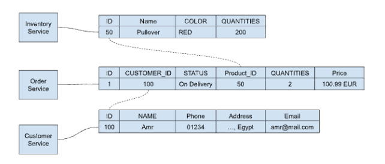
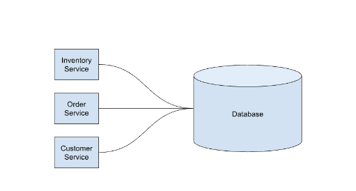
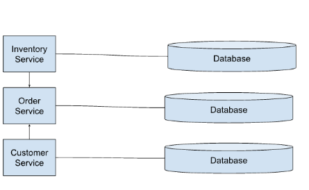

#  Database Per Service

قاعدة بيانات لكل خدمة

تخيل انك تقوم ببناء متجر الكتروني باستخدام نمط الخدمات المصغرة Microservices.  فأنت محتاج تبني قواعد بيانات علشان تخزن الداتا على سبيل المثال:
- خدمة التوصيل والطلبات محتاج تعرف معلومات خاصة عن حاله الدفع و  حالة المنتج إذا تم (الخروج من المخزن، في الطريق الى العميل او وصل الى العميل) الخ.
 - محتاج  خدمه عشان تخزن معلومات خاصة  بالعملاء زي  العناوين والتليفونات والايميلات وطرق الدفع المحببة.
 - محتاج خدمه علشان تشوف في كام منتج عندك في المخزن وسعر المنتج.

## المشكله
 ازاي نبني قاعدة بيانات تخدم على كل الخدمات دى؟ هل نعمل قاعدة بيانات  واحده ولا كل خدمة يبقى ليها  قاعدة البيانات الخاصة بيها؟

من أحد المبادئ Microservices ان كل خدمة بيكون ليها قاعده البيانات الخاصه بها. لان كل خدمه لازم تكون مستقله عن الخدمات الاخرى. فالحل ان احنا نخلى خدمة كل  لها قاعدة البيانات الخاصة بها والسؤال عن المعلومات في قاعدة بيانات أو تحديث المعلومات لازم يتم عن طريق API.

وهنا تظهر مشكلة في التصميم حيث بعض الخدمات بتحتاج معلومات من قواعد بيانات خدمات أخرى. على سبيل المثال لما العميل يطلب منتج لازم التحقق من  خدمة المخزن إذا كان المنتج ده لسه موجود. ولازم التحقق من خدمة الدفع عن العميل دفع المنتج وان لسه معاه فلوس في الكريدت كارد بتاعه تكفي شراء المنتج.

 معنى كده ان انت محتاج خدمه  خارجيه زي Stripe او ماستر كارد تسالها اذا كان العميل معاه فلوس كفايه يشتري المنتج ومحتاج خدمات داخليه علشان تتاكد ان الدفع حصل بالفعل وأن المنتج موجود في المخزن. وفي النهاية لازم نحدث قواعد كل قاعدة بيانات لوحدها بحيث يحصل اتساق في المعلومات المخزنة.

 وده تحدي كبير لان في الاول في معماريه  Monolithic كان هناك قاعدة بيانات واحدة فيسهل عمل Joins اما دلوقتي فعندنا قواعد بيانات موزعة و كل واحده ليها  التحديث الخاص  فيها.

 يعني لما بيحصل اي Transaction لازم نبعت كذا Query يمر على كل القواعد البيانات دي كلها يسألها:
عندي كام منتج في المخزن؟
هل العميل ده معاه رصيد يكفي لشراء الطلب؟
العنوان اللازم للتوصيل و حاله التوصيل
 وبعد ما بيشتري لازم نعمل ابديت لكل قواعد البيانات الموزعة في فتره زمنيه قصيره. 

 معنى كده انك لازم تتجنب سؤال  قاعدة البيانات بشكل مباشر ومحتاج تتكلم عن طريق اي بي اي انك تبعت لها UniqueID وترد عليك بالمعلومات اللي انت محتاجها.

## المميزات؟
استقلالية الخدمات عن بعضها حيث أن كل خدمة خاصة بها ولا تؤثر على خدمات الاخرى 
كل خدمه تقدر تختار  قاعدة بيانات خاصة بها مختلفة عن خدمات الاخرى سواء كانت NoSQL أو Relational
على سبيل المثال الخدمات اللي تحتاج بحث في النصوص يمكن استخدام Elasticsearch والخدمات التي تحتاج علاقات زي الشبكات الاجتماعيه ممكن تسخدم  Graphs DB يمكن استخدام Neo4j.

 ## العيوب؟
 قاعدة بيانات لكل خدمة تؤثر على الاتصال في البيانات بالخدمات المختلفة حيث ان يمكن ان تتاخر تحديث قاعده بيانات على الاخرى وبالتالي يحدث عدم اتساق في البيانات.
إذا حصل خطا في اي Transactions يجب الرجوع في كل الخدمات ومسح الداتا التي تم اضافتها Rollback
و في بعض الأحيان الـ Query دا مش بيكون سهل لأنه بيتطلب Joins بين أنواع مختلفة من قواعد البيانات  النوع Relational وبعدها بتكون NoSQL.

ودا ادى الى ظهور أنماط جديدة في Microservices زي Saga Pattern و CQRS.

## الخلاصة

هناك عدة أسباب لتفضيل استخدام قاعدة بيانات لكل خدمة بدلاً من قاعدة بيانات واحدة:
الفصل والاستقلالية: باستخدام قاعدة بيانات لكل خدمة، يمكننا تحقيق فصل تام بين بيانات كل خدمة. ودا يعني أن اي عطل أو تأثير في إحدى الخدمات لن يؤثر بشكل مباشر على الخدمات الأخرى، مما يجعل النظام أكثر استقرارًا.
الأداء الأفضل: باستخدام قاعدة بيانات منفصلة لكل خدمة، يمكن تحسين أداء قواعد البيانات لتلبية احتياجات كل خدمة على حدة، مما يسمح بتحسين الأداء الشامل للنظام.
الأمان: تقليل الاعتماد على قاعدة بيانات واحدة يقلل من مخاطر الأمان، حيث يمكن تفادي انتشار البيانات الحساسة بين العديد من الخدمات، وبالتالي تقليل فرص الوصول غير المصرح به إلى البيانات.
سهولة الصيانة والتطوير: كل خدمة تعمل على قاعدة بيانات مستقلة يجعل من السهل إجراء التغييرات والتحسينات على كل خدمة بشكل مستقل دون التأثير على الخدمات الأخرى.
بشكل عام، فإن استخدام قاعدة بيانات لكل خدمة يعزز الفصل والاستقلالية ويساعد في تحسين أداء النظام وزيادة الأمان وتبسيط عمليات الصيانة والتطوير. لكن رغم  كل هذه المميزات في فصل قواعد البيانات والعمل بنظام Microservices الا اننا بنواجه مشاكل في اتساق الداتا Data Consistency و صعوبة العمل ب  ACID Compliance اللي تضمن حدوث ال Transactions.
